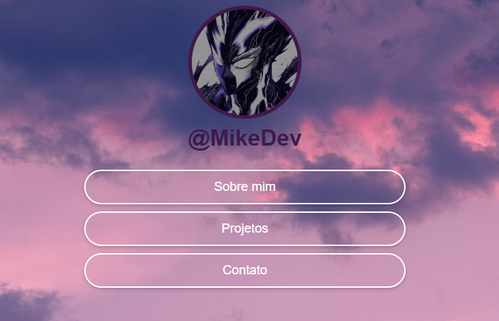

# Portfólio Pessoal

Este é o meu primeiro projeto de desenvolvimento web, onde criei um portfólio pessoal para apresentar minhas habilidades e projetos. Embora não tenha funcionalidades específicas, foi um marco importante na minha jornada de aprendizado.

## Sobre o Projeto

Este portfólio foi criado com o objetivo de praticar e aprender os fundamentos do desenvolvimento web. Ele contém uma estrutura simples e serve como um exemplo do meu primeiro trabalho com HTML e CSS.

## Um Marco na Minha Jornada

Esse projeto representa muito mais do que apenas código para mim. Ele marca o início de uma nova fase na minha vida, onde comecei a transformar ideias e sonhos em realidade por meio do desenvolvimento web. Antes de iniciar este portfólio, o mundo da programação era algo distante, mas ao completar este projeto, percebi que era capaz de construir algo tangível e significativo. Este foi o primeiro passo em uma jornada de mudança de vida, onde descobri minha paixão por programação.

## Demonstração
Caso você queira uma demonstração mais detalhada, [Clique Aqui](https://mikelj917.github.io/Primeiro-Portfolio/)

## Tecnologias Utilizadas

- **HTML5**: Para estruturar o conteúdo da página.
- **CSS3**: Para estilizar e dar um design básico ao portfólio.

## Licença

Este projeto está licenciado sob a Licença MIT - veja o arquivo [LICENSE](LICENSE) para mais detalhes.
